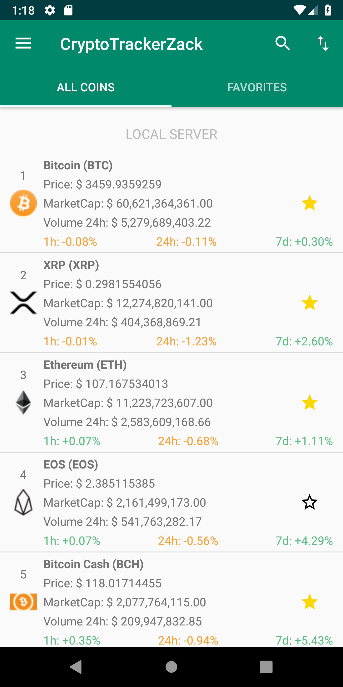

# CryptoTrackerZack

CryptoTrackerZack is an Android app that tracks and displays prices, charts, markets of top crypto currencies. With option to connect to local server, which code is here <a href="https://github.com/ZackPashkin/node.js-localserver-for-crypto-tracker-android-app-">Local Server</a> and <a href="https://github.com/ZackPashkin/local-server-vue-for-android-java-app">Local Server 2</a>

apk is available here on google drive 
<a href="https://drive.google.com/file/d/1GjLmxaqfpX_Hvim_kwdGi2LXqusndEhb/view?usp=sharing">download apk</a>
and in apk folder in <a href="https://github.com/ZackPashkin/CryptoTrackerZack--android-java-app/tree/master/apk">zip</a>

## Libraries Used

* <a href="https://github.com/fcopardo/EasyRest">EasyRest</a>: This library is used extensively for all network calls within the app. It takes care of request caching, multi-threading, and marshalling JSON into objects with Jackson
* <a href="https://github.com/afollestad/material-dialogs">material-dialogs</a>: Library used to show the sorting dialog 
* <a href="https://github.com/GoogleChrome/custom-tabs-client">customtabs</a>: Library used for the web browser with Chrome integrations
* <a href="https://github.com/nex3z/ToggleButtonGroup">ToggleButtonGroup</a>: Library used for the buttons which allow users to toggle the date range on the chart
* <a href="https://github.com/IvBaranov/MaterialFavoriteButton">MaterialFavoriteButton</a>: Library used for the favorite button on the home screen
* <a href="https://github.com/PhilJay/MPAndroidChart">MPAndroidChart</a>: Used to show price over time chart
* <a href="http://square.github.io/picasso/">Picasso</a>: Library used for hassle-free image loading and display
* <a href="https://github.com/google/gson">GSON</a>: Library used to serialize text from the database into real Java objects and vice-versa

## Permissions

`android.permission.ACCESS_NETWORK_STATE`  
`android.permission.INTERNET`

These two permissions are required so that we can talk to the APIs on the internet that give us information about crypto currencies

## Sources

* <a href="https://min-api.cryptocompare.com/">CryptoCompare min-api</a>: This API is currently only used for Markets.
* <a href="https://coinmarketcap.com/">CoinMarketCap</a>
* <a href="https://www.flaticon.com/authors/smashicons" title="Smashicons">Smashicons</a>

## Known common issues

* Unstable Local Server connection
* EUR, RUB pairs for charts are not yet implemented
